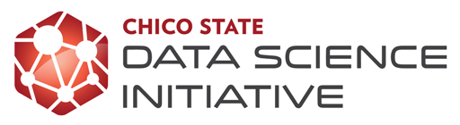

# It's been a busy year (or two)!

Apologies for the radio silence since Spring, it's been pretty busy over here. We have lots of updates to share with you, so what better time to do an end of the year "State of Data Science" wrap up.

## Undergraduate Certificate in Data Science

-   We saw 4 more students graduate with this [certificate](https://catalog.csuchico.edu/colleges-departments/college-natural-sciences/mathematics/data-science-certificate/) in Spring 2023, bringing our total to 19 since the start of the program in 2019.
    -   See their [capstone project repositories here](https://github.com/DATA-490).
-   Current enrollment is at 7 students: 2 from Business Information Systems, 1 from Statistics, 3 from Computer Science and 1 from Organizational Communication. *Side note: We had 2 from Statistics, but a conflict with the upper division Linear Algebra (MATH 435) class that is critical for graduate study conflicts with CSCI 211 this spring, so choices had to be made.*

## Community Coding is back in person!

Got data and working on analysis? Got questions on using R, Python or other programming languages? Great way to dedicate time to working on that project you've been meaning to get around to. Come and hang out with other coders in a welcoming and supportive environment.

{width="631"}

> While most of the [posted hours](https://www.csuchico.edu/datascience/community-coding.shtml) are still individual faculty's office hours, we are striving to rebuild the drop-in open working environment. Wednesdays this Fall are either in Sylvesters, or in the BSS Student Success Center. Both collaborative working spaces.

## New Courses

-   [**Math 131: Introduction to Python**](https://datascience.csuchico.edu/posts/2023-11-13-intro-python-spring-2024/index.en) We are excited to offer, for the first time, Introduction to Python as MATH 131 in spring 2024. Like the sister course [MATH 130 (Intro to R)](https://norcalbiostat.github.io/MATH130/), this will be a 1 unit, credit / no credit course that only lasts the first 5 weeks of the semester. Tu/Th 2-3:15pm.

- **Math 185: Data Science for Social Good**. Students practice collecting and wrangling data into a usable form, visualizing large data sets to discover patterns, representing data in a meaningful way, exploring varying interpretations of the data and results, and discussing potentials for misuse and abuse. This course promotes critical reflection on the ethical, social, cultural, and political dimensions of data as well as providing direct hands on experience with both spreadsheets, and the programming language R. This Freshmen level class carries GE B4 credit. 

-   **Math 500: Data Science Seminar**. This 1 unit seminar explores current and relevant applications and implementations of data science and analytical methods and tools in the field. Seminars will include external and student-led presentations and hands-on tutorials. Emphasis is placed on students sharing and getting feedback on an approved capstone or master's project

-   **CSCI 644: DevOps Engineering** This course introduces students to distributed system administration skills, setting up distributed computation environments, cloud virtualization technologies, and setting up mobile, web, machine learning, artificial intelligence, and data science pipelines.

The [College of Business](https://www.csuchico.edu/cob/) has been expanding their data analytical course offerings. Primarily using SQL, Tableau and Python.

-   MINS 235: Database Design. SQL is essential for everyone!
-   BSIS 308: Decision Analysis for Business. Code-less decision making with data at the core
-   BSIS 421: Business Analytics with Python
-   BSIS 460: Data Analytics. SQL + Analytical algorithms = essential skills for Data Scientists
-   Starting Fall 2024 the MBA - Enterprise Information Systems option will be reconfigured to be an option in Business Analytics.

## New Masters in Data Science and Analytics

We have launched a new [Masters in Data Science and Analytics](https://www.csuchico.edu/math/degrees/msdsa.shtml) 🎉and are accepting applications for Fall 2024

Similar to the Undergraduate Certificate, this program blends the strengths of both the Mathematics and Computer Science departments to create a program that provides both breadth and depth.

The **Applied Analytics** track can be thought of as an applied track, where the focus is for students to collaborate closely with researchers or companies in a domain specific field. Students in this track could be employed in positions where they are the "data person" on a team. This track may appeal more to students from a broad range of majors and domain interests such as nutrition, agriculture, medicine, bioinformatics, journalism, political science and even the digital humanities.

The **Machine Learning** track provides deeper and more technical training on the mathematical and computational underpinnings of the statistical, machine learning and artificial intelligence models being used. This track may appeal to students with backgrounds in areas such as mathematics, statistics, or computer science. Leveraging their more technical backgrounds students in this track will learn how to develop, implement, and integrate algorithmic solutions using massive amounts of data based on artificial intelligence, machine learning, or statistical analysis methods.

Students in the Undergraduate Certificate are strong candidates for acceptance and can even transfer some classes such as MATH/CSCI 485 and MATH 456 over to the Masters program, potentially reducing their time to complete the degree.

::: callout-tip
### Admissions Requirements

-   Calculus II
-   Upper Division Applied Statistics (E.g. Math 314 or 315)
-   Introductory level in both R (Math 130 or equivalent) and Python (MATH 131 or equivalent)

Students wishing to pursue the Machine Learning track must also meet the following requirements before formally declaring the ML track.

-   Calculus III-Multivariable Calculus (MATH 220 or equivalent)
-   Linear Algebra (MATH 235 or equivalent)
-   Programming & Algorithms I (CSCI 111 or equivalent)
-   Programming & Algorithms II- Advanced Object-Oriented Programming (CSCI 211 or equivalent)
:::

## Data Science Club

With it's inaugural meeting this Fall, a [Data Science Club](https://dsclub.carrd.co/) has finally been created at Chico State! The Data Science Club strives to help students learn, discuss, and participate in data science. Ever want to join a club at the ground level and get to be foundational in how it grows? Now is your time. You can find more information on their website, or in their channel on the Math & Stats Discord Server.

{fig-align="center" width="232"}

## Math & Stats Discord Server

Did I mention a [Math & Stats Discord server](https://discord.gg/xCQTAgu8bE)? Sometime in 2020, or 2021 I joined the very popular student-run Discord server for the Computer Science Department. Student moderated and managed, I found their structure of having channels for each class that were permanent, students and faculty join join and leave as needed very helpful.

Coming from a place of using Slack as the back channel communication platform for my classes, and feeling like I had to juggle multiple workspaces per class I joined up with a few other faculty and with the help of a student created a space for multiple Math classes that could be added or dropped as needed.

It is not as chatty or robust as the CS server (not surprisingly), but we hope as more students join and use this space to work on their math and stats classes we can recruit more faculty to join, or at least announce it as a space for their students to collaborate.

::: callout-note
### LFM - Student mod

We're currently looking for new student moderators to help disseminate announcements, cross post cool info from the CS discord, create new channels such as Alumni & Profs and find ways to engage our community!
:::

## NorCal DataFest 2024 - Save the date

Save the Date - April 12-14th at Chico State is the site of the next [NorCal DataFest](https://norcaldatafest.netlify.app/)

The American Statistical Association's DataFest, founded at UCLA in 2011, is a 48-hour data analysis competition in which undergraduate students from various majors get to work in teams on large, complex, and real-world data. The data is kept secret until opening of the event on Friday evening and teams present their findings to a panel of judges on Sunday afternoon. Students explore, analyze, and visualize the data to discover insights. No prior knowledge of programming or data visualization is necessary! Sometimes having a dedicated "storyteller" on the team is the key to victory.

Previous years' data sets have included crime data from the LAPD, dating data from eHarmony, and energy use data from GridPoint. This year's data set will be revealed at the opening of the event on Friday evening.

At the conclusion of the competition, each team will have 5 minutes and 2 slides to make a presentation to a panel of judges. Judges will select teams to win prizes for areas such as "Best Insight", "Best Visualization", and "Best use of External Data".

This event is now rotating across the North State. Last year it was held at Sacramento State, with participants from both Chico and Sac State participating. This year we hope to draw teams from Sonoma and Cal Poly Humboldt as well.

Keep an eye on our [website](https://norcaldatafest.netlify.app/) for more information and registration information. 

## Internships

Our partnership with the [Center for Healthy Communities'](https://www.csuchico.edu/chc/) Research & Evaluation team has been growing! Every semester we have placed 1-2 students from Statistics or other data related majors with them in paid internships, many of which have resulted in longer term paid positions. Some students even stayed on after graduation until finding a full time position or starting graduate school. 

Our partnership with [Project DA-FANH](https://www.dataanalytics4fanh.science/) allowed for the expansion of this internship to other organizations on campus including the Center for Regenerative Agriculture and Resilient Systems, Institutional Research and Strategic Analytics, and the Louis Stokes Alilance for Minority Participation. You can read about these partners on the project [webpage](https://www.dataanalytics4fanh.science/internship/). 

With one more fall cohort of internships, this USDA grant funded project aiming to build pathway for students of color in the intersection of Data Science/Data Analytics within food, agriculture, natural resources and human sciences (FANH) careers. Carrying 3 units, this experience could count towards the DS Certificate, or perhaps your major while providing an authentic career experience using data to make decisions.

# More in the works

DS at Chico is really ramping up. Here are some tidbits to look forward to. 

-   Updating the Certificate to make entry to the field easier, such as adding **Math 185: Data Science for Social Good** and expanding elective courses to include new BSIS classes, and upper division research methods courses in fields such as Agriculture, Political Science and Criminal Justice
-   Reviewing the program requirements for streamlined 4+1 blended BS+MS program
- Seeking funding to support a **Wildcat Data Hub** that would provide assistance with data related tasks such as collection, wrangling/cleaning, visualization and analysis, as well as offer drop-in 1:1 consulting for students and faculty. By offering access to skilled student research assistants, this hub will not only enhance the quality and efficiency of research across disciplines but also create valuable, paid experiential learning opportunities for students.

