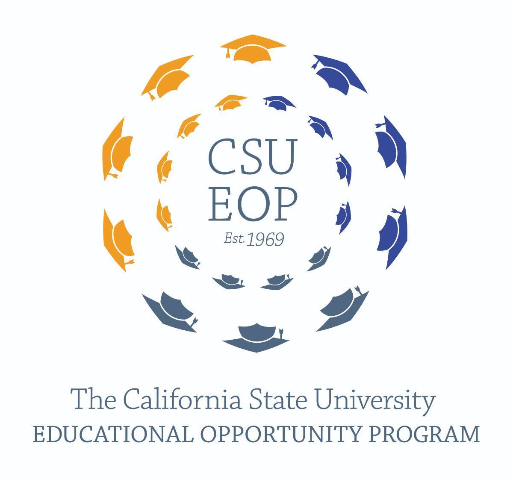
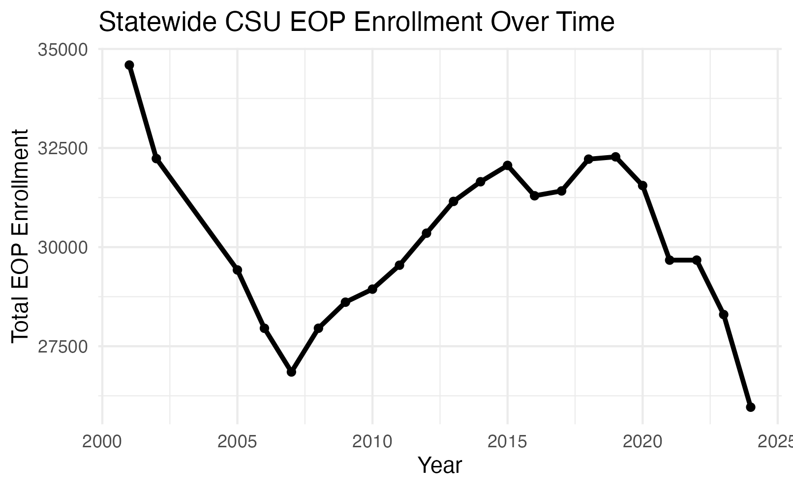
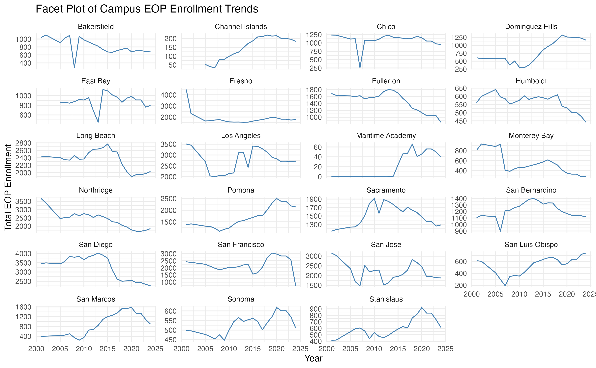
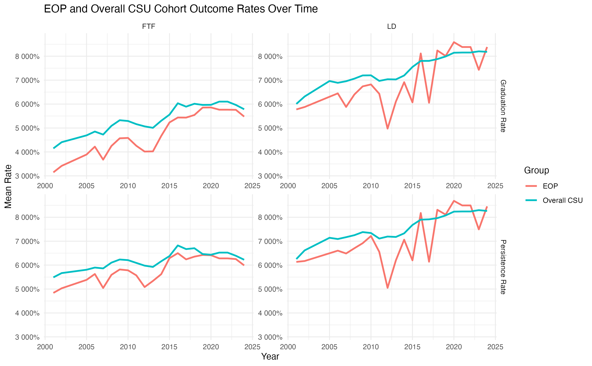
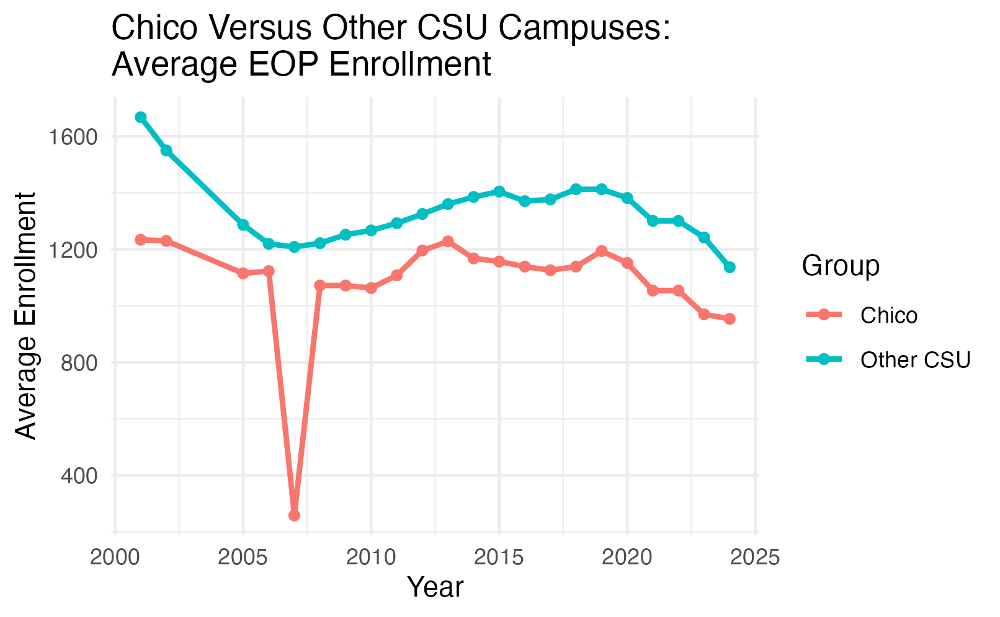
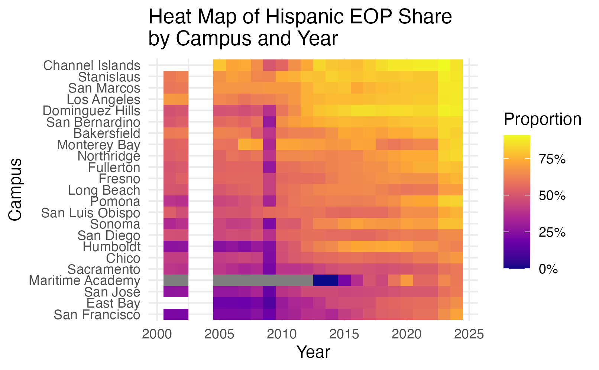
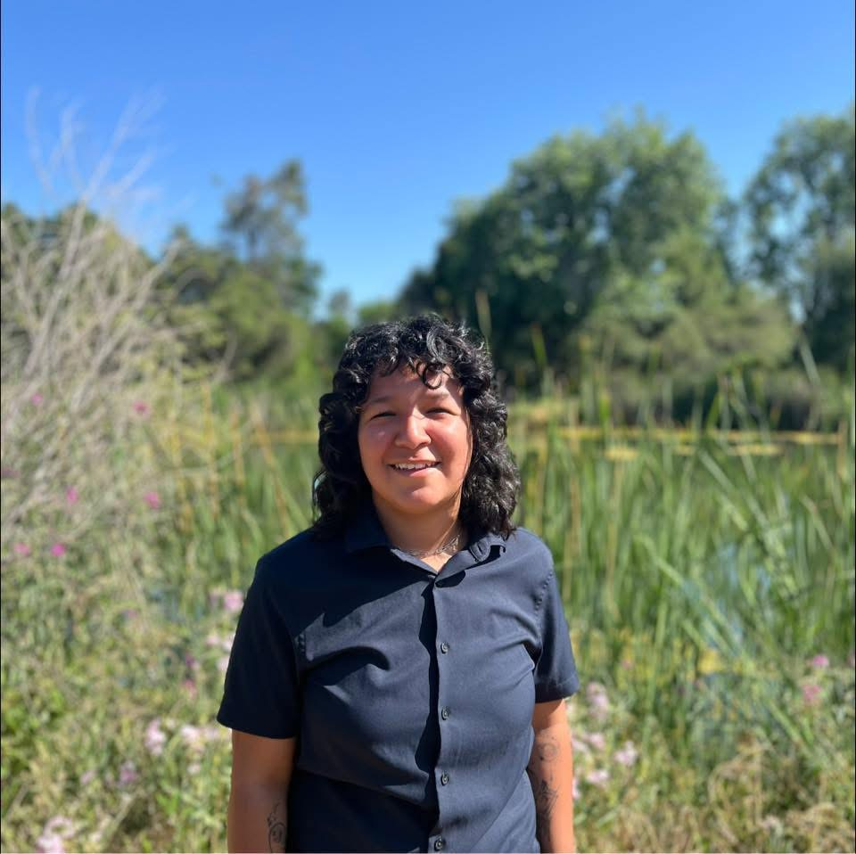

# CSU Education Opportunity Program: Student Success and Enrollment

My capstone project examines long term enrollment and student success patterns in the California State University Educational Opportunity Program(EOP). It is a support system that provides services to students who may have experienced economic, educational, and/or environmental barriers. The goal of EOP is to improve access and support the matriculation, retention, and graduation outcomes of these students. EOP programs may provide services that assist with applications, academic counseling, social events, and learning workshops.  
This project examines CSU EOP enrollment and student success patterns from 2001-2024 using campus-year data from annual CSU EOP reports. I cleaned and combined campus-level enrollment, demographic, persistence, and graduation outcome tables into one analysis ready dataset. The final project focuses on statewide trends, campus-level differences, Chico State as a case study, and whether major disruption periods such as the post - 2007 budget era and the COVID-19 period correspond with changes in enrollment or outcomes.

**Main takeaway:** CSU EOP enrollment and student success outcomes are both time and campus dependent. A statewide average is useful, but it can hide important differences across campuses.

## Project Goal

The goal of this project was to better understand how EOP participation and student success have changed across CSU campuses over time.

More specifically, this project asks:

1. How have CSU EOP enrollment, persistence, and graduation outcomes changed over time?
2. How do EOP persistence and graduation outcomes compare with the broader CSU student population?
3. How does Chico State compare with broader CSU patterns?
4. Do major disruption periods, including the post-2007 budget era and COVID-19 period, correspond with changes in EOP enrollment or outcomes?
5. How has the racial and ethnic composition of CSU EOP enrollment changed across campuses over time?

## Data Sources and Preparation

The original data came from annual CSU EOP enrollment Excel workbooks. These workbooks included multiple sheets per year, inconsistent title rows, changing column names, multirow headers, repeated column names, campus totals, and notes mixed into the tables.

To make the data usable, I built a cleaning workflow that:

- reads annual Excel workbooks from 2001 to 2024,
- identifies table headers automatically,
- standardizes campus names,
- harmonizes changing variable names across years,
- converts enrollment and outcome columns to numeric values,
- creates a wide campus-year dataset for modeling,
- creates a long format dataset for time-series plotting.

The final cleaned dataset contains one row per campus per year for 23 CSU campuses and 22 reporting years. The years 2003 and 2004 were not included because those reports were unavailable.

Some missing values are structural. For example, certain campuses or reporting categories were introduced later in the timeline. Because of this, broad imputation was not used in the final analysis. Models use the complete cases needed for each research question.

## Methods

Due to the dataset following the same campuses over time, I treated the data as a campus-year panel dataset. This means that each observation represents one campus in one year.

The main methods included:

- descriptive time series plots,
- campus-level trend and facet plots,
- demographic proportion plots and heat maps,
- paired EOP versus overall CSU comparisons,
- Wilcoxon signed rank tests,
- mixed effects models with campus as a random effect,
- piecewise models for disruption periods.

Mixed effects models were especially useful because the same campuses appear repeatedly across years. Including campus as a random effect allowed each campus to have its own baseline level while still estimating overall statewide patterns.
 
 

## Interactive dashboard and webpage
<iframe src="https://public.tableau.com/app/profile/anna.sustayta/viz/CSUEOPEnrollmentandStudentSuccessTrends/CSUEOPStudentSuccess" width="600" height="200"></iframe>

**[Tableau](https://public.tableau.com/app/profile/anna.sustayta/viz/CSUEOPEnrollmentandStudentSuccessTrends/CSUEOPStudentSuccess){target="_false"}**

## Key Findings

::: {.panel-tabset}

## 1. EOP Enrollment

Statewide EOP enrollment did not follow a simple straight line trend. Enrollment declined in the early 2000s, recovered through much of the 2010s, and declined again after 2020.

{fig-alt="Statewide CSU EOP enrollment over time." width="85%"}

This pattern suggests that a simple linear model is not enough to describe long term EOP enrollment. Time periods and campus differences both matter.

## 2. Campus-level Differences

Some campuses consistently had much larger EOP enrollment than others. Campuses such as San Diego, Los Angeles, Northridge, Long Beach, and San Francisco were among the largest EOP campuses in the dataset. Smaller campuses, including Maritime Academy and Channel Islands, had much lower enrollment levels.

{fig-alt="EOP enrollment trends for each CSU campus." width="90%"}

These differences support the use of campus level modeling. A statewide average alone does not fully represent the variation across the CSU system.

## 3. EOP vs CSU Comparison

For first time freshman cohort outcomes, EOP graduation and persistence rates were lower than the broader CSU comparison group on average. However, the lower division class has bridged this gap over time, and at some points transcends their cohort. The average graduation gap was about 5.5 percentage points lower for EOP, and the average persistence gap was about 3.6 percentage points lower. 
 {fig-alt="Eop vs CSU Comparision." width="85%"}

However, this should be interpreted carefully. EOP serves students who may face additional educational and economic barriers, so the comparison is not meant to suggest that EOP is ineffective. Instead, it shows where continued support and monitoring may be needed.

## 4. Chico State 

Chico State's EOP enrollment was generally below the CSU campus average in size, but its pattern over time was similar to the broader CSU trend. Chico's enrollment stayed around 1,100 to 1,200 students for much of the 2000s and 2010s, then declined after 2020.

{fig-alt="Chico State EOP enrollment compared with broader CSU averages ." width="85%"}

This suggests that Chico State's recent EOP enrollment decline may reflect systemwide pressures rather than only local campus specific factors.

## 5. Hispanic and Latino representation 

Demographic composition was analyzed using proportions instead of raw counts because campuses differ in size. Hispanic and Latino students made up the largest share of EOP enrollment and increased over time. This case study heat map of Hispanic and Latino proportions also showed that this share varied across campuses.

{fig-alt="Heat map of Hispanic and Latino EOP enrollment proportion by campus and year." width="90%"}
:::

## Impact and Applications

This project can help CSU leaders, campus EOP programs, and student success researchers understand how EOP participation and outcomes have changed over time.

The project has several possible applications:

- **Program monitoring:** Identify long term enrollment declines or recovery periods.
- **Campus comparison:** Show which campuses differ from systemwide patterns.
- **Student success tracking:** Compare EOP outcomes with broader CSU cohort outcomes.
- **Equity focused planning:** Track how EOP demographic composition changes over time.
- **Post-2020 analysis:** Highlight where enrollment declines may need additional attention.

## Platforms and Tools Used

- R and RStudio
- Quarto
- tidyverse
- readxl
- janitor
- lme4
- broom.mixed
- ggplot2
- Tableau
- GitHub

## Lessons Learned

Working on this project showed me that data cleaning is one of the most important parts of a real data science project. The raw CSU EOP reports were not immediately ready for analysis because table formats and variable names changed across years.

The project also helped me understand why the structure of the data should guide the modeling choices. Since the data were repeated by campus over time, mixed effects models were more appropriate than treating every row as independent.

Finally, I learned that results need to be interpreted carefully. This project can show trends and associations, but it cannot prove that one event caused the observed changes.

## Limitations

Several limitations should be kept in mind:

- The data are aggregated at the campus-year level, not the individual student level.
- The analysis can identify trends and associations, but not causal effects.
- Some reporting categories changed over time, especially race and ethnicity categories.
- The dataset does not provide graduation or persistence outcomes separately by demographic group.
- Chico State student level EOP participation and support usage data were not available.

## Future Enhancements

Future work could improve this project by:

1. adding individual student level data if available,
2. including campus-level EOP funding, staffing, or program support measures,
3. testing random slope mixed effects models,
4. building a formal sensitivity analysis for missing values and reporting changes,
5. expanding the Tableau dashboard for public exploration
6. comparing outcomes by demographic group if those data become available.

## About the Repository

The complete project repository includes the cleaning workflow, cleaned datasets, exploratory analysis, final poster materials, and website files.
- data folder holds raw excel data sheets, and the cleaned sheets for reproducible results.
- `qmd/data_cleaning.qmd` contains the data cleaning and aggregation of the raw data
- `qmd/final.qmd` contains the data modeling, statistical methods, and findings

**GitHub repository:** 
[asustayta](https://github.com/DATA-490/2026-anna_sustayta){target="_blank"}

## Acknowledgments

Thank you to the Chico State Mathematics and Statistics Department and Dr. Nicholas Lytal for his guidance and feedback throughout this project.I would also like to acknowledge California State University's Data Base
for providing public data on the Educational Opportunity Program.

 ---

## About me
::: columns
::: {.column width="40%"}
{width="388"}
:::

::: {.column width="10%"}
:::

::: {.column width="50%\""}
I am a Mathematics-Statistics student at California State University, Chico with interests in data science, statistical modeling, and education analytics. I enjoy using R, Quarto, and visualization tools to clean data, explore trends, and communicate findings in an accessible way. When I am not applying my academic skills I like to explore nature, further my knowledge in music theory, and practice my instruments.
:::
:::

