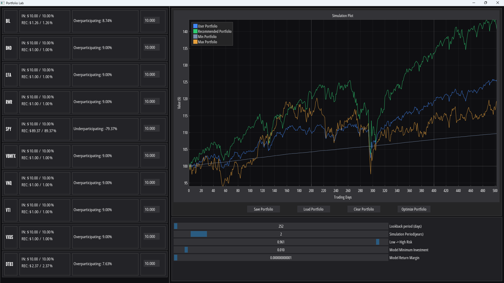
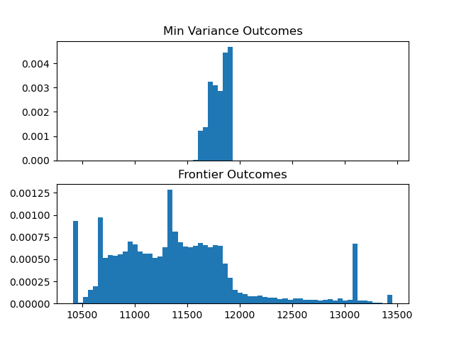
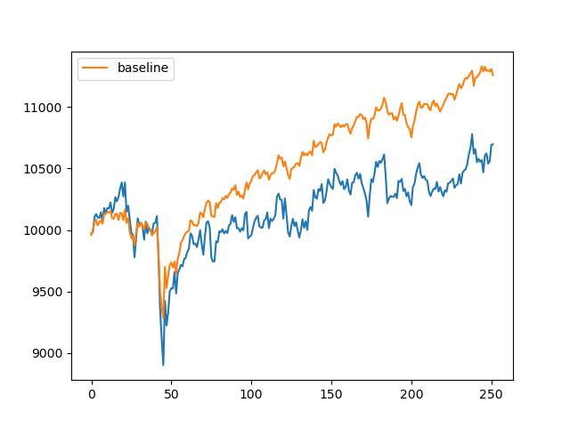

<!-- Header Image -->

# Introduction

Portfolio Lab is a portfolio optimization assistant app. Using mean-variance optimization the app constructs optimized portfolios according to user specifications.

The purpose of this app is twofold:

1. As a portfolio optimization assistant, Portfolio Lab helps users to visualize how their portfolio allocation decisions affect the portfolio outcome.

2. As an exploratory education tool, Portfolio Lab demonstrates that mean-variance optimization is highly sensitive to small changes in input, which results in portfolio outcomes that are unstable.

## Platforms used

* Core language: Python
* Interface: DearPyGui, Tkinter
* Data/analysis: pandas, NumPy
* Visualization: matplotlib, seaborn
* Modeling/optimization: cvxpy, sklearn

## Data Collection

The driving variable for this optimization process is daily return data. The original dataset was generated by joining an assortment of sources, including the [Kaggle Huge Stock Market Dataset](https://www.kaggle.com/datasets/borismarjanovic/price-volume-data-for-all-us-stocks-etfs?resource=download), yahoo (through the `yfinance` Python package, see `fetch_yahoo.py`), and [FRED](https://fred.stlouisfed.org/series/DTB3). This data was utilized with `eda.ipynb`, `markowitz.py`, and later in `rolling_window_test.py`.

As progress continued on this project it became clear that this original data set was insufficient. I created an account with Alpha Vantage and used `fetch_alphaV.py` to fetch close price data for a chosen set of assets from their historical data api.

The primary data driving this project is daily return data from a set of 10 assets chosen to represent 5 financial 'classes':

| Class                   | Asset | Reason                                                                     |
|-------------------------|-------|----------------------------------------------------------------------------|
| U.S. Equities           | SPY   | Large captialization U.S. stocks, common benchmark.                        |
| U.S. Equities           | VTI   | CRSP total market index, exposure to smaller U.S. stocks.                  |
| International Equities  | EFA   | Exposure to developed non-U.S. markets.                                    |
| International Equities  | VXUS  | Vanguard's total international stock ETF.                                  |
| Fixed Income            | BND   | Broad U.S. bond market exposure.                                           |
| Fixed Income            | VBMFX | Long standing Vanguard mutual fund.                                        |
| Real Assets / REITs     | VNQ   | Tracks U.S. real estate equity investment trusts.                          |
| Real Assets / REITs     | RWR   | ETF intended to track index of U.S. Real estate investment trusts (REITs). |
| Cash / Cash Equivalents | BIL   | Bloomberg 1-3 month T-bond ETF, approximates HYSAs and MMFs.               |
| Cash / Cash Equivalents | DTB3  | 3-month U.S. T-bill rate published by the Federal Reserve.                 |

## Data Modeling & Analysis

A few months into the semester, it became apparent that the original data set would not suffice for the purposes of this app. The joined data set contained only 7 years of trading data, and it stretched across a bull market without correction. Results from models derived from this data consistently underperformed a naive asset distribution baseline. Seeking to understand my poor model performance, I started to find [results](https://academic.oup.com/rfs/article-abstract/22/5/1915/1592901) that implied my data set was explicitly insufficient to consistently generate well-performing portfolios, mean estimate error would outweigh optimization gain.

::: {style="text-align: center;"}

:::

In my initial design for this app, the idea was to abstract several related assets into an overarching class by averaging their daily return data. I believed that averaging the assets into abstract classes would average daily return values, resulting in mean values that were easier to predict. While exploring the poor performance of my model in `naive_vs_markowitz.ipynb` I learned that modeling across the original assets resulted in considerably better portfolio outcomes. I believe this is because collapsing multiple assets into averaged classes reduced meaningful covariance that the optimizer could otherwise use to leverage assets against each other.

## Impact & Applications

Portfolio Lab functions well as a tool for exploring how optimization succeeds and fails. In demonstrating the sensitivity of the mean-variance method for portfolio optimization, portfolio allocations generated by Portfolio Lab are not recommended as real financial advice. Portfolio Lab is best used to explore potential portfolio allocations and how they may have performed over these 10 assets during the simulated period.

## Lessons learned

1. Mean-variance optimization is promising on paper, but in practice optimization error leads to inconsistent performance, over the time period and assets in my data set.
2. Making unproven assumptions can be fatal for model performance. I made two assumptions during the development of this project.
    1. I thought that abstracted, averaged asset classes would form an easier problem to optimize. My results (`naive_vs_markowitz.ipynb`) demonstrate that this was not true.
    2. I thought that the use of daily return data would provide my model with useful information. However, while reviewing other work I've found that monthly data is much more commonly used for financial optimization, since daily noise is smoothed across the month and monthly returns tend to be closer to a normal distribution.

::: {.panel-tabset}
:::
## Add a profile and bio so readers can learn more about you
::: columns
::: {.column width="40%"}

:::

::: {.column width="10%"}
:::

::: {.column width="50%\""}
Drew is a Chico native graduating from CSU Chico with a BS in computer science and a certificate in data science. Drew has gained significant experience in modeling physical systems while working alongside a civil engineering professor during his time at CSU Chico. His love for optimization finds no limit, extending from debate, to finance, to policy. Outside of academic and professional pursuits, Drew enjoys working on his car, weightlifting, and tinkering with just about anything.
:::
:::
