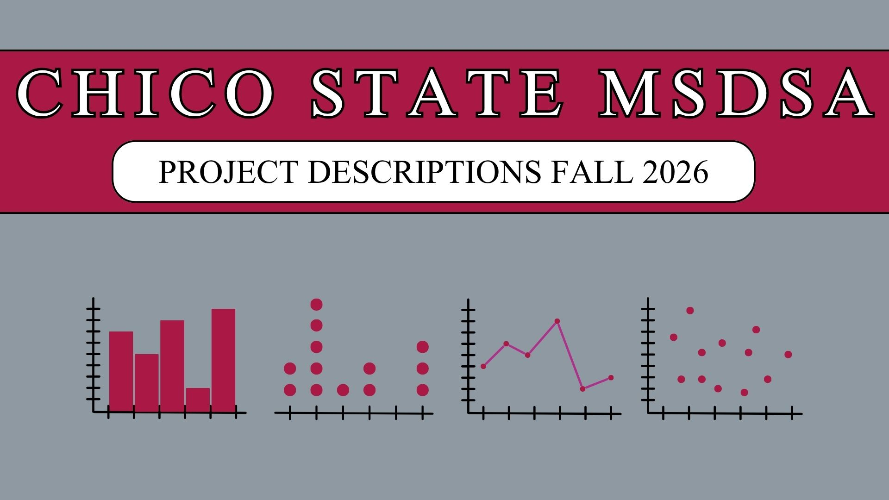

<!-- Header Image -->

Masters project ideas for the 2025 cohort of [Masters in Data Science and Analytics](https://www.csuchico.edu/academics/majors-programs/data-science-and-analytics-ms.shtml) students. 

### Statistical Optimization of Prompt engineering strategies for reliable theme extraction and narrative synthesis using LLM

**_Zaynab Abdulraheem_** 

This project aims to find the best instruction to guide a model output when prompted to generate code and themes within an organization qualitative data. Currently, the time and effort put into manually analyzing qualitative data is very tedious. Recent research in the field have been focused on ways to make this process efficient, which has led to the development of strategies including few-shot prompting and chain-of-thought reasoning. This research will build on this established strategies, and recent emerging methods of using LLM to generate, test and refine prompt recursively to build a workflow that prompt an LLM to help generate codes and themes, evaluate its output by comparing to human-generated codes and themes, and select the best optimized prompt for this process.

---

### Soil Health Zone Classification and Yield Prediction for Rice Farming Operations

**_Devon Rhodes_** 

Precision agriculture generates substantial field-level data, yet these data often remain siloed across incompatible formats and vendors. This project integrates soil sensor measurements, yield monitor data, and laboratory soil reports into a unified dataset for a commercial rice operation in California's Sacramento Valley, in collaboration with Lundberg Family Farms.

Using correlation analysis, k-means clustering, and gradient boosting, the analysis examines which soil health indicators are most associated with yield variation and where those relationships are spatially concentrated across the farm. Results are presented through an R Shiny dashboard intended to support variable-rate fertilizer and amendment decisions, with a design that generalizes beyond a single operation.

---

### Work truck demand forecasting

**_Katherine Luce_** 

It takes up to six months to get a work truck upfit with a body type before it can be sold for construction projects. This project works with a local Chico company, Work Truck Solutions (WTS), that provides websites and business intelligence insights to work truck dealers. Currently, WTS relies on real-time inventory snapshots to estimate demand, a method that limits data to only what is currently happening. This project aims to transition WTS from a descriptive "current-state" method to a predictive forecasting framework capable of anticipating regional demand six months in advance. This study seeks to identify the primary drivers of work truck demand by analyzing historical vehicle sales and lead data alongside exogenous variables such as construction spending, property tax trends, building permits, and natural disaster impacts. The methodology involves exploratory data analysis, feature selection via LASSO and Recursive Feature Elimination (RFE), and the evaluation of various time-series and machine learning models. Model performance will be compared using metrics such as RMSE and the Granger Causality Test. This project intends to provide a demand model that enables dealers to optimize inventory effectively.

---

### Analyzing Cross-Lingual Hallucination in Multilingual LLMs under LoRA-based Fine-Tuning

**_Fumiya Nagatomo_** 

LLMs have demonstrated strong multilingual capabilities, enabling them to perform tasks across different languages. However, fine-tuning techniques can significantly influence these capabilities. For instance, fine-tuning can improve domain-specific performance but may also affect the model’s ability to generalize across languages or influence its tendency to generate hallucinated responses. In particular, parameter-efficient methods such as Low-Rank Adaptation (LoRA) have been proposed to reduce the number of trainable parameters while maintaining competitive performance, but they impose a low-rank constraint on model’s parameter updates, which may limit the model’s expressive capacity. While LoRA has been proposed, its impact on cross-lingual generalization remains insufficiently understood. Specifically, it is unclear whether the reduced expressive capacity affects the model’s ability to transfer knowledge across languages. So, this project will investigate how LoRA-based fine-tuning influences cross-lingual hallucination (e.g. Japanese and English) by comparing with full fine-tuning model as a baseline.

---

### Retrieval Augmented Generation vs. Prompt-Only: AI-Generated Themes

**_Durge Kumar_**

The [Center for Healthy Communities](https://chcchicostate.org/) (CHC) collects narrative data from CalFresh Outreach campuses. This project focuses on reducing the time and effort needed to analyze qualitative data by developing a custom AI agent and reproducible workflow for thematic analysis. The study will compare a retrieval augmented generation (RAG) pipeline with a prompt-only model. A RAG system is an approach where the large language model retrieves information from a stored knowledge base before generating a response, while a prompt-only model generates responses using only the instructions and prompts provided to the model.

The objective of this study is to determine whether RAG significantly improves the alignment, reliability, and consistency of AI generated themes compared to prompt-only systems when evaluated against human generated ground truth themes. Thematic alignment between AI generated and ground truth themes will be evaluated using metrics such as Precision, Recall, F1-score, and Jaccard similarity.

---

### A Data-Driven Analysis of County Liaison Effectiveness Across California Higher Education and County Offices

**_Natalie Hernandez_**

In 2021, the State of California established a liaison position within each county social services department to serve as a point of contact for higher education institutions. The purpose of this role is to support campus staff and students in the enrollment process for CalFresh, Medi-Cal, and CalWORKs, as each county has different procedures and verification requirements.

The [Center for Healthy Communities](https://chcchicostate.org/) (CHC), which works closely with California State University, Chico, collected survey data from both campus staff and county liaisons across the state to evaluate the impact of the liaison position. A deeper analysis of these surveys may help identify which aspects of communication and engagement contribute to an effective liaison and may help predict the strength of county and campus relationships of entities that did not participate. Understanding these factors could improve the effectiveness of the liaison role and help guide future policy decisions.

---

### Detecting Fish Passage Barriers Across California Watersheds

**_Marlen Martinez-Lopez_** 

This project applies spatial analysis and predictive modeling to predict fish passage data gaps in selected watersheds across California. By generating stream-road intersection points, and training machine learning models on known barrier records, these methods provide a technical basis for prioritizing fish passage survey efforts across California. Digital elevation models, road and bridge inventories, and the National Fish Barrier Tool provide the geospatial inputs necessary to support fish passage data gap analysis across California's watershed network 

---

### How Do Housing Market Responses to Macroeconomic Shocks Differ Across U.S. States?

**_Andy Chen_**

Since 2020, home prices and inflation have both gone up a lot, and buying a home has gotten way harder for most people. But depending on where you live, the situation looks pretty different. California and New York are already expensive and hard to build in, while Texas has more room to grow and lower prices, so the same interest rate hike is going to hit these states in very different ways.

My project looks at exactly that. I'm using quarterly data from the Fed's FRED-QD database along with state-level house price data from the FHFA to study how housing activity changes when inflation or interest rates shift, across seven states: California, New York, Texas, Florida, Ohio, Illinois, and Arizona. I'm running panel regressions with state fixed effects to test whether states with tight housing supply respond differently than states with more flexibility. I'm also checking whether the COVID pandemic changed how these relationships work, and comparing a few different modeling approaches to see which one predicts housing activity best.

---

### Analyzing the Impact of Reward Structures on Agent Behavior in Unity ML-Agents

**_Daniel Lee_** 

The objective of this study is to analyze how AI agents with different reward structures influence behavior and strategy formation in an environment based on Unity ML-Agents reinforcement learning. The reward structures are trained through thousands of reinforcement learning iterations in the same 3D simulation environment using the PPO (Proximal Policy Optimization) algorithm. Different rewards are initially designed for each agent through different reward designs in order to induce different behaviors for each agent. In this study, the types of agents include single-objective and multi-objective agents, and there exists the same penalty when they fail to accomplish the assigned objectives. Through this, the study analyzes how behavioral characteristics such as aggressiveness, explorability, and survivability differ. Learning logs and behavioral data are collected through the Unity ML-Agents Python API, and data preprocessing and normalization are performed using pandas and NumPy. Based on data such as action selection frequency, movement distance, and target achievement time, regression analysis and clustering techniques are used to analyze the relationship between reward structures and behavior. Through this, the study aims to understand the effect of reward design on strategy formation in reinforcement learning agents and apply it to game AI and game design for diverse player experiences.

---

### Predicting SLA Breaches in IT Service Desk Tickets Using Machine Learning

**_Vinay Patil_** [LinkedIn](linkedin.com/in/vinay-california)

Every day, IT support teams handle hundreds of tickets from employees and customers reporting technical problems. Each ticket comes with a deadline called a Service Level Agreement or SLA, which tells the team how quickly they need to resolve the issue. When a ticket is not resolved in time it is called an SLA breach, and this can lead to financial penalties, unhappy clients, and in serious cases like hospitals or emergency services, real safety concerns.

This project uses a publicly available dataset of over 46,000 IT support tickets to build a machine learning model that predicts whether a ticket is likely to breach its SLA before the deadline passes. The project compares three models and looks at ticket features like priority level and number of reassignments to understand what drives breach risk.

---

### Do Firm Networks Help Nonparametric Models Forecast Cross-Sectional Stock Returns Beyond Classic Factors?

**_Derrick Jones_** Contact: dkjones2 [at] csuchico [dot] edu

This project aims to see if firm-to-firm networks help nonparametric models forecast cross-sectional returns beyond classic factors. Cross-sectional return prediction asks which stocks will outperform others next month. Classic factors from traditional economics like size, value, and momentum capture some of this variation, but recent research has shown that firms connected through supply chains, shared investors, and correlated price movements share information that affects their returns. My research combines the nonparametric side of machine learning with these network-based studies.

I extend a nonparametric model by adding a penalty that pulls predictions toward similarity for firms connected in a network. The penalty can be turned off to recover the no-network baseline exactly, providing a clean test of whether networks add value. The strategy is evaluated against the Fama-French and q-factor models, with implications for portfolio construction and risk diversification.

---

### A Graph-Based Compatibility Prediction Framework for Dating Applications

**_Jesus Daniel Martinez_** 

The project aims to seek an alternative framework for dating app applications, using a deep learning algorithm and comparing it to a base one, Gale-Shapley algorithm, since this is the closest to an algorithm disclosed for dating apps. This is to try to capture compatibility in a more specific way, and at the same time taking into account  individuals who are complementary to one another. Also, seeing what traits and what characteristics are associated with individuals that are developing a relationship in an online setting and using those to predict whether or not they are likely to develop a relationship. Additionally taking into account how trade offs in relationships are measured and how this can affect the development of relationships in an online environment.

---

### PM2.5 Exposure and Hospital Admissions in Butte County

**_Sandesh Raykar_** 

Butte County, California experiences severe PM2.5 (Particulate matter with diameter 2.5mm) pollution from wildfires, traffic, and industrial activity, yet limited research has examined how these exposures affect local hospital admissions. This project investigates associations between PM2.5 exposure and respiratory and cardiovascular hospitalizations using a time stratified case crossover design. Wildfire smoke days are separated from non wildfire high pollution days. The study also evaluates whether the national PM2.5 safety threshold adequately protects Butte County’s older population, which is more vulnerable to fine particulate exposure even at federally acceptable levels. By estimating the magnitude and timing of PM2.5 related admission increases, the project aims to determine whether county specific air quality thresholds may better protect communities with elevated health risks.

---

### Investigating Chico Farmer Markets: Relationship with EBT and Demographics

**_Angel Aguirre_** 

This study investigates the demographic composition of market attendees and examines sampling techniques for estimating the proportions relative to the total market population. It then assesses the potential revenue increase associated with installing a market‑match booth at the Thursday market. Analytically, the research employs regression models incorporating categorical fixed effects and clustering by market type to control for unobserved heterogeneity. A revenue‑prediction framework is constructed that integrates observable market characteristics, enabling forecast of Thursday’s earnings under the scenario where a market‑match booth is present.

---

### Predicting Bus Schedule Adherence Using AVL Telemetry & Passenger Count Data

**_Ashish Dixit_** 

Bus delays hurt passengers and reduce trust in public transport. This project builds a tool to predict whether a bus will arrive early, on time, or late at scheduled stops, using detailed operational data recorded automatically by onboard GPS and tracking systems. Working with a partner transit agency, raw log files are parsed to extract useful information such as dwell time at stops, delays carried over from earlier stops, time of day, and passenger counts where available. A Random Forest model is then trained to classify arrival status, and results are explained using a method that shows which factors matter most. The final output includes both a technical report and a plain-language summary with specific recommendations the agency can act on to improve reliability.

---

### Is wildfire risk accurately priced into Northern California home values?

**_Hasham Hussain_** 

Wildfire risk in Northern California has grown significantly in recent years, but it is not clear whether home prices actually reflect this risk. This project uses home sale data from Butte, Shasta, and Tehama counties alongside CAL FIRE fire hazard zone ratings to test whether homes in higher risk areas sell for less than comparable homes in safer areas. It also uses the 2018 Camp Fire as a before and after reference point to test whether the disaster changed how buyers think about fire risk when purchasing a home. Data comes from Redfin, CAL FIRE, the US Census, and the National Interagency Fire Center. Results will be shared through a written report and an interactive dashboard.

---

### Predicting Cascading Flight Delays Using Deep Learning and Network Modeling

**_Prabin Subedi_** 

Flight delays are common, but the bigger problem is how one delay can spread through the flight network. A delayed aircraft can affect its next flight, airport congestion can delay many routes, and passengers may miss connections before they realize the risk. This project studies cascading flight delays and passenger connection risk using public flight, weather, and airport congestion data.

The project will use Bureau of Transportation Statistics flight records, Open-Meteo weather data, live flight tracking data, and derived airport congestion features. First, an XGBoost model will be trained as a baseline using individual flight features. Then, a flight network graph will be built using aircraft rotation, airport time-window, and schedule buffer relationships. A Graph Neural Network will then be used to predict delay risk by learning from both each flight and nearby connected flights.

The final goal is to build a model and web app where users can enter their flight and connection information to see delay and missed connection risk. This project can help passengers understand risk earlier than normal flight status apps and make better travel decisions.

---

### Spatial Demand Forecasting and Vertiport Placement Optimization for Urban Air Mobility

**_Richa Tiwari_** 

As electric air taxis prepare for commercial launch in U.S. cities under the FAA's 2026 eVTOL Integration Pilot Program, a critical infrastructure question remains unanswered: where should vertiports - the takeoff and landing stations for air taxis - be located to maximize ridership and operational efficiency? This project develops a machine learning framework that uses publicly available urban mobility data, including NYC ride-share trip records, U.S. Census demographics, and OpenStreetMap points of interest, to forecast passenger demand across hexagonal geographic zones and recommend optimal vertiport placements in three FAA pilot cities: New York City, Dallas-Fort Worth, and Miami. Using XGBoost and LightGBM models trained on NYC data and applied to Dallas and Miami through cross-city transfer learning, combined with Maximum Coverage Location Problem optimization, the framework produces data-driven vertiport network recommendations validated against real operator location announcements.

